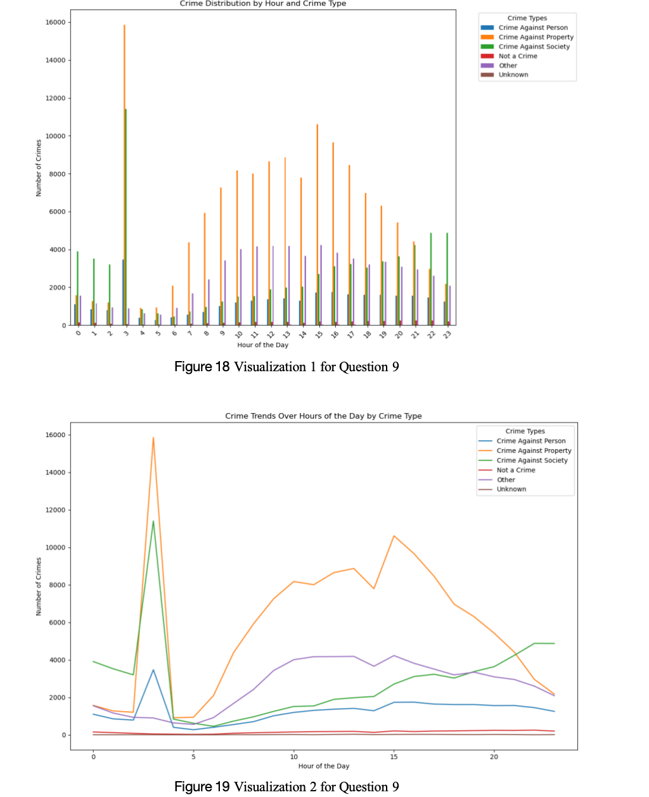
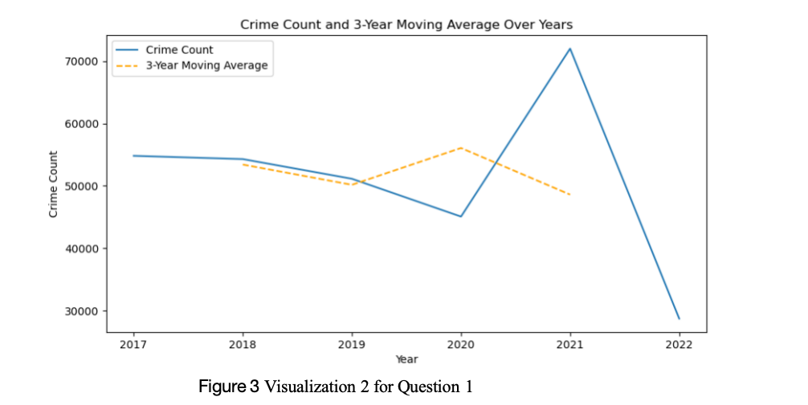
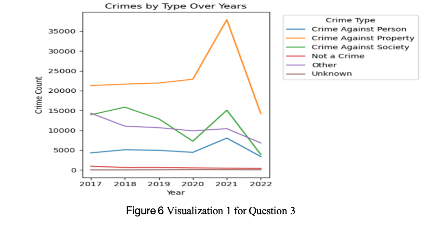
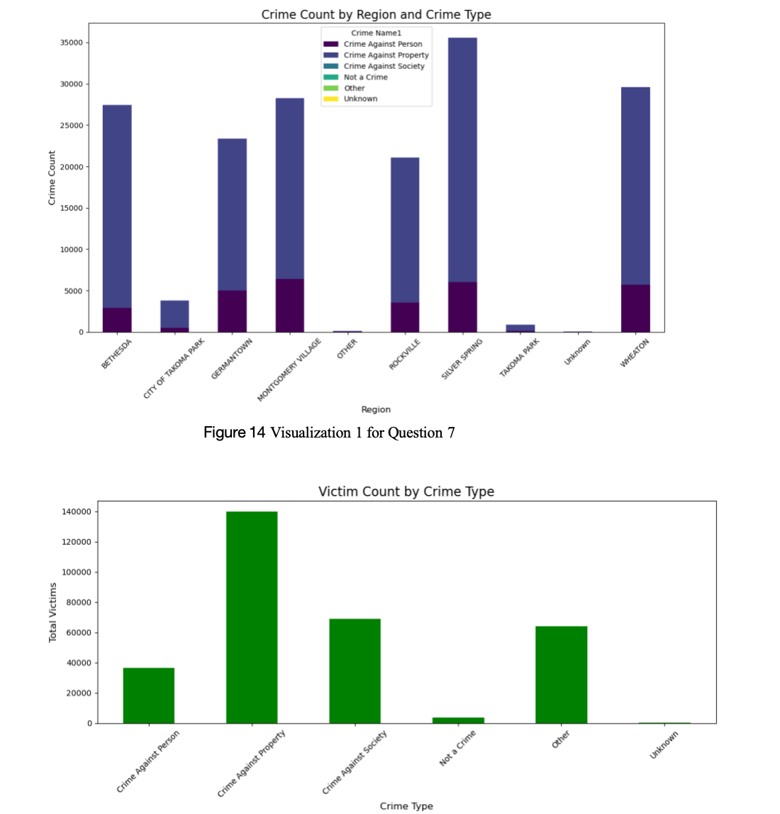

# Analyzing Crime Patterns and Prevention Strategies: Montgomery County

## Project Overview
This repository contains a comprehensive analysis of crime data from Montgomery County, examining patterns, trends, and insights that can inform effective strategies for crime prevention and community safety. The analysis covers reported incidents from 2018 to 2022 derived from the National Incident-Based Reporting System (NIBRS).

## Dataset Description
The dataset provides extensive crime statistics from Montgomery County, containing over 300,000 entries across 30 columns including:
- Incident identifiers
- Crime classifications and offense codes
- Temporal data (dates and times)
- Geographic information (locations, coordinates)
- Victim demographics

## Research Questions
The analysis addresses ten key research questions:
1. Is there a clear decrease in crime over the years?
2. Which crimes have seen the most significant decrease?
3. Which area has experienced the greatest decrease in crime rates?
4. What are the most common types of crime in this dataset?
5. How do crime incident frequencies vary by police district?
6. What is the distribution of crime types across police districts?
7. What are the peak times and days for crime incidents?
8. What are the trends in crime distribution based on time of day for each crime type?
9. How does crime distribution vary between weekdays and weekends?
10. What demographic factors are associated with crime rates in different areas?

## Key Findings

### Crime Distribution
- Urban districts (Silver Spring, Wheaton, Montgomery Village) report higher crime counts
- Property crimes constitute 45.7% of incidents
- Crimes against society represent 22.5% of incidents
- Crimes against persons account for 9.9% of incidents
  

### Temporal Patterns
- Crimes peak late at night, especially on Fridays and Saturdays
- Notable spikes occur around 3-5 AM and 12-1 PM
- Crimes against persons are significantly higher on weekends

  
 
*Distribution of crimes across different hours of the day*

### Yearly Variations
- Crime rates fluctuated significantly over the study period
- 2020 saw a decline in crime, likely due to pandemic restrictions
- 2021 showed an increase as restrictions eased

  
  
  *Annual crime trends showing fluctuations between 2018-2022*
  

### Data Insights
- Montgomery County Police Department (MCPD) is the most frequently recorded agency
- "6P2" is the most common patrol beat
- Bethesda Police District has the highest crime count (42,778 reports)
- Silver Spring tops crime locations with 105,487 cases

## Key Visualizations
The repository includes various visualizations:

### Geographic Distribution

## Tools & Technologies
- Data analysis: Python (pandas, numpy)
- Data visualization: Matplotlib, Seaborn
- Geospatial analysis: Custom mapping libraries
- Statistical analysis: Python statistical packages

## Further Resources
  Checkout the python file for the detailed analysis
## License
This project is licensed under the MIT License - see the [LICENSE](LICENSE) file for details.

